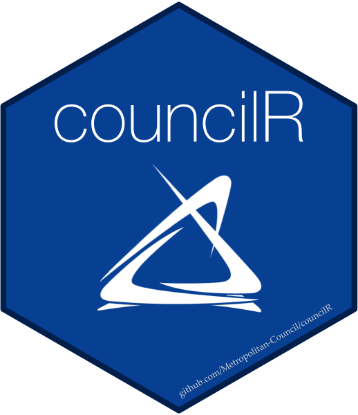

<!-- README.md is generated from README.Rmd. Please edit that file -->

# councilR 

<!-- badges: start -->

[](https://github.com/Metropolitan-Council/councilR/actions)
[](https://lifecycle.r-lib.org/articles/stages.html#stable)
<!-- badges: end -->

`{councilR`} is a collection of commonly used templates, color palettes,
and functions for R users at the Metropolitan Council.

## Installation

You can install the released version of `{councilR}` from GitHub.

``` r
remotes::install_github("Metropolitan-Council/councilR")
```

## Contributing

Please see our contribution guidelines [here](.github/CONTRIBUTING.md).

### Acknowledgements

Thanks to all the folks who have contributed to this project in one way
or another

[@ashleyasmus](https://github.com/ashleyasmus),
[@ehesch](https://github.com/ehesch),
[@eroten](https://github.com/eroten),
[@velicknd](https://github.com/velicknd),
[@Brandon-Whited](https://github.com/Brandon-Whited),
[@LimerickSam](https://github.com/LimerickSam), and
[@leonx075](https://github.com/leonx075).
