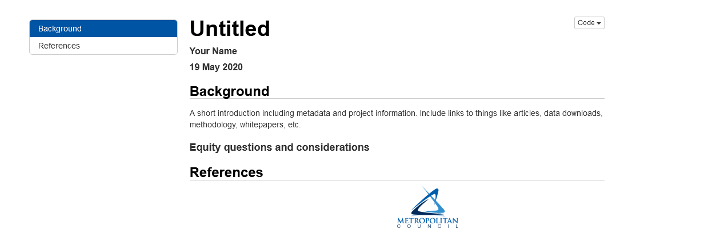
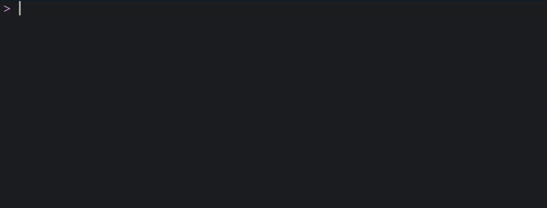
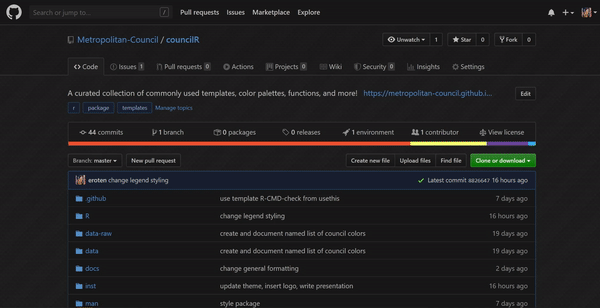

```{r setup, include=FALSE}
options(htmltools.dir.version = FALSE,
        crayon.enabled = TRUE)
old.hooks <- fansi::set_knit_hooks(knitr::knit_hooks)
knitr::opts_chunk$set(echo = FALSE,
                      warning = FALSE,
                      message = FALSE)
```

```{r xaringan-themer, include=FALSE, warning=FALSE}
library(xaringanthemer)
library(xaringanExtra)
library(fansi)
xaringanExtra::use_animate_css()
# style_solarized_light()
```
class: center, middle

# Slides live at [lizroten.info/talks](https://lizroten.info/talks)

---
class: inverse, center, middle, hide-logo

# What is an R package anyway?

---
class: center middle hide-logo

```{r}
xaringanExtra::text_poster("Packages are the fundamental units
                           of reproducible R code." )
```

.pull-right[
.footnote[-[Hadley Wickham](http://r-pkgs.had.co.nz/)]
]
---

# R Packages  

--

- Typically open-source  

--

- Generally make life easier

--

- Can be small and simple, or major projects.

---
## Common R packages  

--

 


--

<blockquote><p lang="en" dir="ltr">If I&#39;ve learned anything at this conference, it&#39;s that these people are f****** obsessed with hexagon stickers <a href="https://twitter.com/hashtag/rstudioconf?src=hash&amp;ref_src=twsrc%5Etfw">#rstudioconf</a></p>&mdash; Liz Roten (@LizRoten) <a href="https://twitter.com/LizRoten/status/1222706398103920640?ref_src=twsrc%5Etfw">January 30, 2020</a></blockquote> <script async src="https://platform.twitter.com/widgets.js" charset="utf-8"></script>


---
class: inverse, center, middle, hide-logo

# Introducing   

.animated.fadeInUp[

# `councilR`

]
---

# `{councilR}`

An R package for storing Council colors, templates, and commonly used functions.  

--

.animated.fadeIn[

Install

```{r, eval = FALSE, echo = TRUE}
remotes::install_github("Metropolitan-Council/councilR")
```
  ]
  
--

.animated.fadeIn[
And load  

```{r, echo = TRUE}
library(councilR)
```
]
---
class: inverse, hide-logo, animated, fadeIn, center, middle

# Anatomy  

---
class: inverse, hide-logo, animated, fadeIn

```
councilR
├── .github/
├── data/
├── data-raw/
├── docs/
├── inst/
├── man/
├── R/
├── tests/
└── councilR.Rproj
```

---
class: inverse, hide-logo, animated, fadeIn

```
councilR
*├── .github/ # GitHub testing and Issue template
├── data/      
├── data-raw/
├── docs/  
├── inst/
├── man/
├── R/
├── tests/
└── councilR.Rproj
```

---
class: inverse, hide-logo, animated, fadeIn

```
councilR
├── .github/
*├── data/      # .rda files only
├── data-raw/
├── docs/
├── inst/
├── man/
├── R/
├── tests/
└── councilR.Rproj
```
---
class: inverse, hide-logo, animated, fadeIn

```
councilR
├── .github/
├── data/ 
*├── data-raw/  # .csv, .xlsx, etc.
├── docs/
├── inst/
├── man/
├── R/
├── tests/
└── councilR.Rproj
```
---
class: inverse, hide-logo, animated, fadeIn

```
councilR
├── .github/
├── data/      
├── data-raw/
*├── docs/  # pkgdown site
├── inst/
├── man/
├── R/
├── tests/
└── councilR.Rproj
```
---
class: inverse, hide-logo, animated, fadeIn

```
councilR
├── .github/
├── data/      
├── data-raw/
├── docs/  
*├── inst/ # raw templates 
├── man/
├── R/
├── tests/
└── councilR.Rproj
```
---
class: inverse, hide-logo, animated, fadeIn

```
councilR
├── .github/
├── data/      
├── data-raw/
├── docs/  
├── inst/
*├── man/ # generated documentation
├── R/
├── tests/
└── councilR.Rproj
```
---
class: inverse, hide-logo, animated, fadeIn

```
councilR
├── .github/
├── data/      
├── data-raw/
├── docs/ 
├── inst/
├── man/
*├── R/ # .R files
├── tests/
└── councilR.Rproj
```
---
class: inverse, hide-logo, animated, fadeIn

```
councilR
├── .github/
├── data/      
├── data-raw/
├── docs/ 
├── inst/
├── man/
├── R/
*├── tests/ # testing .R files
└── councilR.Rproj
```
---
class: inverse, hide-logo, animated, fadeIn

```
councilR
├── /
├── .gitignore
├── .Rbuildignore
├── DESCRIPTION
├── LICENSE
├── LICENSE.md
├── README.md
├── README.Rmd
├── NAMESPACE
├── CODE_OF_CONDUCT.md
├── _pkgdown.yml
└── councilR.Rproj

```


---
class:inverse, middle, center, hide-logo

# Features  

---

# Access brand colors  

What is the hex code for Council blue?

```{r, echo = TRUE}
colors$councilBlue
```
--
.animated.fadeInUp[
```{r, echo = TRUE, out.width=1}
matrix(names(colors), nrow = 5,ncol = 5 )
```

]
---
# View all colors  

```{r, echo = TRUE, fig.height=3,  dev='png'}
library(ggplot2)
library(purrr)

plots <- map(seq(1:29), function(x){
  ggplot() +
  geom_rect(mapping = aes(xmin = 0, xmax = 3,
                          ymin = 0, ymax = 3),
            fill = colors[x][[1]]) +
  theme_void()
})

cowplot::plot_grid(plotlist = plots, nrow = 3, ncol = 8)
```

---

# Custom `{ggplot2}` theme  

.pull-left[
```{r, echo = TRUE, fig.height = 3}
ggplot(iris, aes(x = jitter(Sepal.Width),
                 y = jitter(Sepal.Length),
                 col = Species)) + 
 geom_point() + 
 labs(x = "Sepal Width (cm)",
      y = "Sepal Length (cm)",
      col = "Species",
      title = "Iris Dataset")
```
]

--

.pull-right.animated.fadeInRight[
```{r, echo = TRUE, fig.height=3}
ggplot(iris, aes(x = jitter(Sepal.Width),
                 y = jitter(Sepal.Length),
                 col = Species)) + 
 geom_point() + 
 labs(x = "Sepal Width (cm)",
      y = "Sepal Length (cm)",
      col = "Species",
      title = "Iris Dataset") +
  council_theme(use_showtext = TRUE) #<<
```

]

---

```{r, echo = TRUE, fig.width=10, fig.height=4, fig.align='center'}
ggplot(iris, aes(x = jitter(Sepal.Width),
                 y = jitter(Sepal.Length),
                 color = Species)) + 
 geom_point() + 
 labs(x = "Sepal Width (cm)",
      y = "Sepal Length (cm)",
      col = "Species",
      title = "Iris Dataset") +
  council_theme(use_showtext = TRUE) +
  scale_color_manual(values = c(colors$councilBlue, #<<
                                colors$cdGreen,     #<<
                                colors$mtsRed))     #<<
```

---

# RMarkdown template

Lives in `inst/rmarkdown/templates`



--

.animated.fadeInUp[

  Includes Council logo!
]
---

# Snippets  

.pull-left[

Install helpful snippets for RStudio.  

```{r, echo = TRUE, eval = FALSE}
snippets_install()
```

 
]

--
.pull-right[
.animated.FadeInRight[

Plus MPO counties!  

```{r, echo = TRUE, eval = FALSE}
# counties_mpo
c("Hennepin",
  "Dakota",
  "Carver",
  "Ramsey",
  "Anoka",
  "Scott",
  "Washington",
  "Wright",
  "Sherburne")
```
]
]

---
# And More!  

--

New functions and features will be added...  

--

by me...  

--

or anyone else!  

---
class: inverse, middle, hide-logo, center

# Contributing  

(pay attention here for a walk-through)

---


# Bug reporting  

.pull-left[

1. Go to [https://github.com/Metropolitan-Council/councilR](https://github.com/Metropolitan-Council/councilR)   

2. Go to "Issues" tab > click "New Issue" button  

3. Fill in form (don't forget to Label and Assign!)  

4. Click Submit  

]

.pull-right[



]

---

# References, additional resources, etc.


[An Introduction to R at Met Council](https://www.katiejolly.io/met-council-R/index.html) by Katie Jolly  

[Zen and the Art of R Package Development](https://zenartofrpkgs.netlify.app/#1) by Malcolm Barrett  

.center[Slides created via the R package [**xaringan**](https://github.com/yihui/xaringan).]

