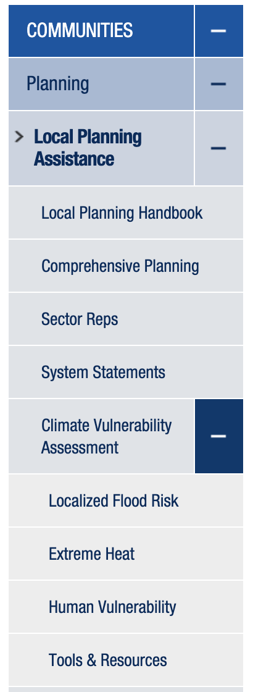

```{r chunk-opts, include = FALSE}
knitr::opts_chunk$set(
  collapse = TRUE,
  comment = "#>",
  warning = FALSE,
  message = FALSE,
  fig.width = 7
)
```

```{r setup}
library(councilR)
library(ggplot2)
library(purrr)
library(grDevices)
library(stringr)
library(cowplot)
library(tibble)
```

This package contains a set of Council brand colors. These are values pulled directly from the Council Brand Standards [document](https://www.metrotransit.org/Data/Sites/1/media/logos/brand_standards.pdf)

```{r plot-color-preview}
color_table <- tibble::tibble(
  name = names(colors),
  value = colors
)

plots <- purrr::map(seq(1:length(colors)), function(x) {
  ggplot(mapping = aes(
    xmin = 0, xmax = 1,
    ymin = 0, ymax = 1
  )) +
    geom_rect(fill = colors[x][[1]]) +
    geom_label(
      aes(
        x = 0.5,
        y = 0.5
      ),
      label = color_table[1][x, ],
      size = 3
    ) +
    theme_void()
})
cowplot::plot_grid(plotlist = plots)
```


## Generate color ramps   

First, lets create an example plot.

```{r plot-example}
plot_example <- ggplot(datasets::airquality) +
  aes(x = Solar.R,
      y = Wind,
      color = as.factor(Month)) +
  geom_point()
```


```{r color-range-blue}
color_range_blue <- colorRampPalette(c("#e0e3e8", colors$playDaBlue))

plot_example +
  scale_color_manual(values = color_range_blue(5)) +
  theme_council(use_showtext = F)
```
```{r color-range-green}
color_range_green <- colorRampPalette(c("#EEF3E5", colors$cdGreen))

plot_example +
  scale_color_manual(values = color_range_green(5)) +
  theme_council(use_showtext = F) +
  labs(y = stringr::str_wrap(
    "Axis labels are now horizontal, but you still need to insert some code to wrap long labels",
    width = 15
  ))
```

## Blue cascade  

`blue_cascade` is a named list with specific background and text colors. These are useful for cascading menus, like the once below.



```{r blue-plots}
blue_plots <- map(seq(1:length(blue_cascade)), function(x) {
  ggplot(mapping = aes(
    xmin = 0, xmax = 1,
    ymin = 0, ymax = 1
  )) +
    geom_rect(fill = blue_cascade[x][[1]][1]) +
    geom_text(
      aes(
        x = 0.5,
        y = 0.5
      ),
      label = names(blue_cascade)[x],
      color = blue_cascade[x][[1]][2],
      size = 4
    ) +
    theme_void()
})

cowplot::plot_grid(plotlist = blue_plots)
```


## Council paletttes

`scale_color_council()` and `scale_fill_council` will give a color palette starting with `councilBlue`, followed by `cdGreen` and and `mtsRed` and then a couple other council colors which will look decent afterwards (up to 8 levels).

```{r color-councilpalette}
plot_example +
  councilR:::scale_color_council() +
  theme_council(use_showtext = F) +
  labs(y = stringr::str_wrap("Axis labels are now horizontal, but you still need to insert some code to wrap long labels", width = 15))
```

## Update to `theme_council()`

There is the traditional `theme_council()` but now also `theme_council_open()` which will be more appropriate for simple scatterplots or lineplots.

```{r}
plot_example +
  councilR:::scale_color_council() +
  theme_council_open(use_showtext = F) +
  labs(title = "This is theme_council_open()")
```

`theme_council_geo()` is best for maps. 

```{r plot-county, eval = TRUE}
fetch_county_geo(progress_bar = FALSE) %>%
  ggplot() +
  aes(fill = ALAND) +
  geom_sf() +
  theme_council_geo() +
  labs(title = "Counties")
```

## Council plotly theme

Increasingly, Council folks are using Plotly for interactive visualizations. You can apply appropriate font families and sizes using `council_layout()`.

```{r plotly-aq}
library(plotly)
plotly::plot_ly(
  type = "scatter",
  mode = "markers",
  data = datasets::airquality,
  x = ~Solar.R,
  y = ~Wind,
  color = ~month.name[Month],
  hoverinfo = "text",
  colors = unlist(unname(colors)),
  hovertext = ~ paste0(
    month.name[Month], "<br>",
    "Solar R: ", Solar.R, "<br>",
    "Wind: ", Wind, " mph"
  ),
  marker = list(
    size = 10,
    opacity = 0.8
  )
) %>%
  council_layout(
    main_title = "Air Quality",
    subtitle = "Wind and solar",
    x_title = "Solar R",
    y_title = "Wind (mph)",
    legend_title = "Month",
    # additional arguments passed directly to plotly::layout()
    legend = list(orientation = "h",
                  x = 0,
                  y = -0.3,
                  xref = "paper",
                  yref = "paper")
  )
```

